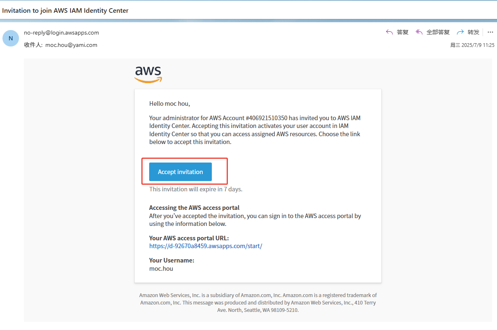

Skip navigation

Tech
导入文档未选择任何文件
IDE 扩展 Amazon Q 插件
Amazon Q 开发者版是功能强大的生成式人工智能助手，用于构建、操作和转换软件，具有管理数据和 AI/ML 的高级功能。Amazon Q 开发者版不仅能帮助编码，还能帮助开发人员和 IT 专业人员完成所有任务，从编码、测试和部署，到故障排除、执行安全扫描和修复、现代化应用程序、优化 AWS 资源以及创建数据工程管道。数据科学家可以获得指导，以快速轻松地构建分析、AI/ML 和生成式人工智能应用程序。

1、查看自己邮箱账户中主题为“ Invitation to join AWS IAM Identity Center ”的邀请邮件，并接受邀请；

2、根据提示设置新密码进行注册，请注意用户名为全小写；

3、设置完成后登录即可看到 Amazon Q 应用；

4、切换回 VS Code IDE ，在插件栏中搜索安装 “Amazon Q”；

5、安装完成后点击对应图标，选择 “Company account” 进行注册；

6、根据邮件邀请内容设置 “Start URL” 为：https://d-92670a8459.awsapps.com/start/ ，可用区选择 “us-west-2” 进行登录；

7、然后打开弹窗中的链接进行认证通过即可；

注：当前过期时间设置为 90 天，超过该时间需要重新执行步骤 5 和 6 进行认证。

8、然后即可开始在 VS Code 中使用 Amazon Q 插件作为 AI 助手。

此处以 VS Code 举例说明安装过程，其实 Amazon Q 还可应用于 JetBrains 系列工具以及其他命令行环境，请自行参考链接操作。

JetBrains：https://plugins.jetbrains.com/plugin/24267-amazon-q

命令行：https://docs.aws.amazon.com/zh_cn/amazonq/latest/qdeveloper-ug/command-line-supported-envs.html
